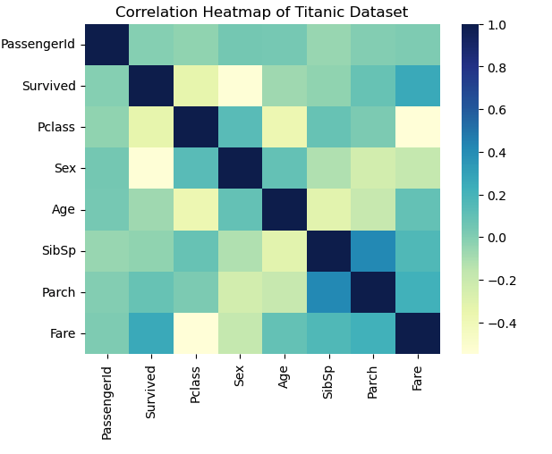
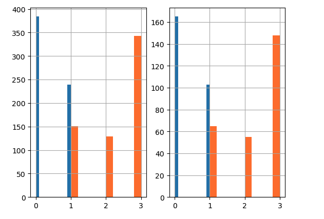
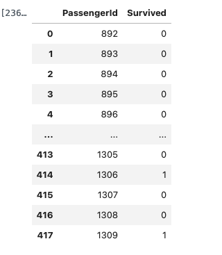

# Titanic-Machine Learning from Disaster
 This is the legendary Titanic ML competition – the best, first challenge for you to dive into ML competitions and familiarize yourself with how the  [Kaggle Titanic Competition](https://www.kaggle.com/competitions/titanic) platform works. The goal is to predict survival outcomes of passengers using machine learning, with a focus on automating the model selection and tuning process.


# The Challenge
The sinking of the Titanic is one of the most infamous shipwrecks in history.

On April 15, 1912, during her maiden voyage, the widely considered “unsinkable” RMS Titanic sank after colliding with an iceberg. Unfortunately, there weren’t enough lifeboats for everyone onboard, resulting in the death of 1502 out of 2224 passengers and crew.

While there was some element of luck involved in surviving, it seems some groups of people were more likely to survive than others.

In this challenge, we ask you to build a predictive model that answers the question: “what sorts of people were more likely to survive?” using passenger data (ie name, age, gender, socio-economic class, etc).


##  Objective

To build, train, and evaluate a classification model that predicts survival outcomes of Titanic passengers using historical data. This project demonstrates an end-to-end ML workflow including:

* Data loading & exploration
* Feature engineering & preprocessing
* Model training & evaluation
* Feature importance analysis

---

##  Tools & Technologies

| Tool                    | Purpose                      |
| ----------------------- | ---------------------------- |
| **Python**              | Core programming language    |
| **Pandas, NumPy**       | Data handling & manipulation |
| **Matplotlib, Seaborn** | Data visualization           |
| **Scikit-learn**        | Machine learning models      |
| **Jupyter Notebook**    | Interactive development      |

---

##  Project Structure

```
titanic-ml-pipeline/
├── _Titanic_machine_learning_Workflow.ipynb
├── train.csv
├── test.csv
├── README.md
├── gender_submission.csv
└── predictions.csv
```

---

##  Exploratory Data Analysis (EDA)

* Visualized survival rates by `Sex`, `Pclass`, and `Embarked`
* Investigated missing data (notably `Age`, `Cabin`, `Embarked`)
* Correlation matrix highlighted key predictors

---

##  Feature Engineering

* Extracted `Title` from `Name` (e.g., Mr, Mrs, Miss)
* Created `FamilySize` (SibSp + Parch + 1)
* Created `IsAlone` flag based on `FamilySize`
* Binned `Fare` and `Age` into categorical ranges

---

##  Models Applied

* Logistic Regression
* Random Forest Classifier
* Gradient Boosting Classifier
* Support Vector Machine

---

##  Evaluation Metrics

* **Accuracy**
* **Confusion Matrix**
* **Classification Report (Precision, Recall, F1)**

---

##  Correlation Heatmap



##  Bar Graph



##  Final output



---

## 💡 Key Takeaways

* **Sex** and **Pclass** are strong predictors of survival
* **Feature engineering** can significantly improve model performance
* **Ensemble models** like Random Forest perform better than baseline Logistic Regression
* Simple models with thoughtful preprocessing can reach >80% accuracy

---

## 🧪 Future Improvements

* Use **XGBoost** or **LightGBM** for advanced performance
* Hyperparameter tuning via GridSearchCV or Optuna
* Deploy model using Flask/Streamlit
* Integrate SHAP for explainable AI

---

## 👩🏽‍💻 About the Author

**Mary Eyeson**
Dallas, TX
B.Sc. in Computer Information Systems
[msa.eyeson@gmail.com](mailto:msa.eyeson@gmail.com)
[LinkedIn](https://www.linkedin.com/in/mary-ayisah-eyeson)
